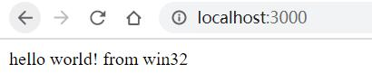
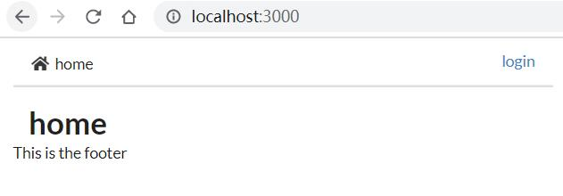
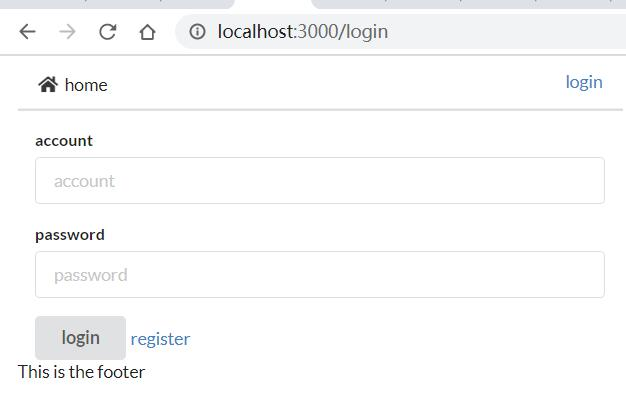
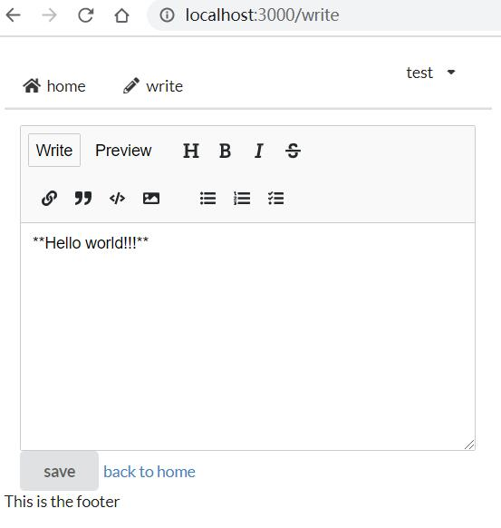
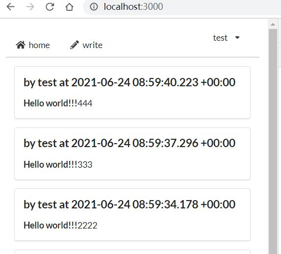

# build a blog site with shack.js

## init project with react + typescript template

```
npx @shack-js/cli init blog-site -t react-typescript
cd blog-site
npm i
yarn dev 
```
now check localhost:3000 to see if it's working


## define database tables

let's use sequelize, and [example codes](https://github.com/shack-js/shack.js/tree/main/examples/react-sequelize) can help

```
npm i sequelize sqlite3 -S
npm i @types/sequelize @types/express -D
```

add sequelize files 
- `common/sequelize.ts` the instance
- `common/User.ts` the user model
- `common/Article.ts` the Article model

and we need to create tables when we first start
- `apis/_init.ts` create tables if needed 

```
// apis/_init.ts
await sequelize.sync()
```


nothing changed yet

## use history instead of hash 

set all routes to index.html
```
// apis/_init.ts
app.use('*', (req, res) => res.sendFile(join(config.assetsFolder, 'index.html')))
```

ref resources with absolute path
```
// shack.config.mjs
  output:{
    ...
    publicPath: '/'
  }
```

- `web/index.tsx` basic htmls and basic routes



## user register and login

suppose using md5 for hash, and jwt for token

```
npm i md5 jsonwebtoken -S
npm i @types/md5 @types/jsonwebtoken -D
```

- `apis/user.ts` register and login

to add register and login page, we first need to add router and ui

```
npm i react-router-dom semantic-ui-react semantic-ui-css -S
npm i @types/react-router-dom css-loader style-loader -D
```

- `shack.config.mjs` add style/css/file loader
- `apis/_auth.ts` try get user from jwt header
- `apis/user.ts` add `info` method so login user can get his info
- `web/stores.ts` add stores for token and user, sync token from/to localstorage
- `web/Navbar.tsx` render menus based on login state
- `web/Content.tsx` render components based on route
- `web/login/index.tsx` login/register page
- `web/home/index.tsx` home page **empty**
- `web/write/index.tsx` write page **empty**



## writing stories

let's use `react-mde` for markdown editor

```
npm i react-mde showdown -S
npm i @types/showdown -D
```

- `apis/authed/_auth.ts` allow only user already login
- `apis/authed/article.ts` add `add` method to store markdown
- `web/write/index.tsx` edit markdown and save 



## home blog list

load old blogs when you scroll to bottom

```
npm i react-infinite-scroll-component react-showdown -S
```

- `apis/article.ts` load articles from db
- `web/home/index.tsx` show articles 



and yes it's done!

## try on yourself

```
npm i
npm run dev
```